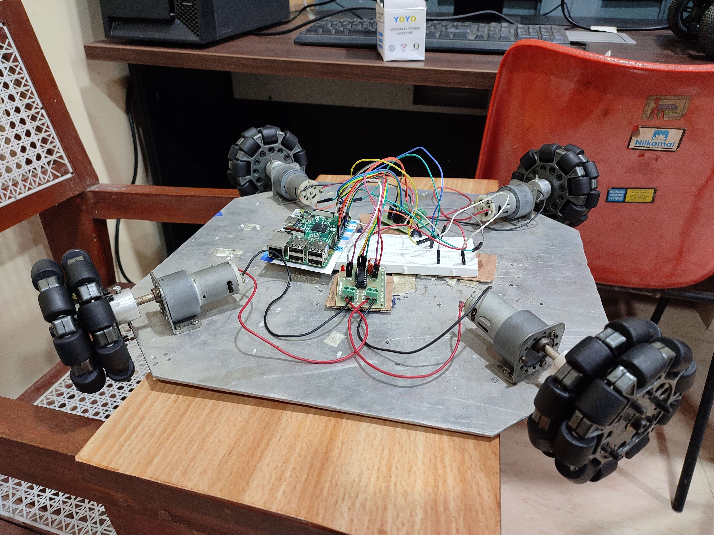
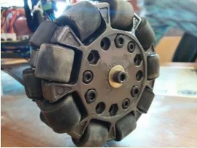

# Omni-Directional Bot

## Introduction

This robotic platform is equipped with four omni-directional wheels and an Raspberry Pi control board, designed to provide mobility in various environments.

## Features

- The key feature of this bot lies in its omni-directional wheels, equipped with small discs (rollers) around the circumference. These rollers are perpendicular to the turning direction, allowing the bot to be driven laterally.

- Due to the specialized wheels, the robot can move in any direction without the need for turning or rotating. This capability makes it ideal for tasks in environments with static and dynamic obstacles, as well as crowded areas.

## Images
- Omni-directional bot

- Omni-directional wheels

